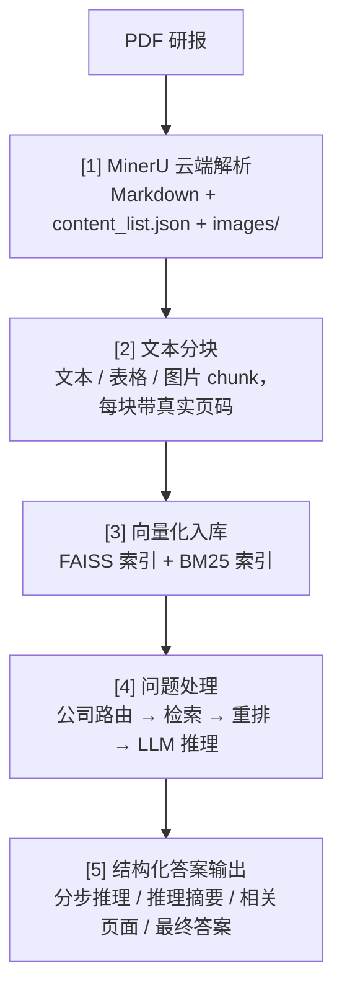

> # 企业知识库 RAG 系统

基于深度检索增强生成（RAG）的企业研报问答系统，针对中芯国际相关券商研报、财报、机构调研纪要等 PDF 文档，提供可溯源的多步推理问答。系统通过 **MinerU 云端解析** + **AGICTO 平台大模型**（`qwen3.8-max` 文本模型 / `text-embedding-v4` 嵌入模型）+ **FAISS / BM25 混合检索** + **LLM 重排** + **结构化 Chain-of-Thought 推理**，实现从 PDF 原始文档到可溯源答案的端到端流水线。

---

## 系统架构



全流程说明：PDF 研报经 MinerU 云端 API 解析为 Markdown 与结构化 `content_list.json`（保留真实页码、表格、图片），按 `page_idx` 进行多模态分块后同时构建 FAISS 向量索引与 BM25 关键词索引；问答时先做公司路由，再混合检索、LLM 重排筛选上下文，最终由大模型生成结构化、可溯源到具体 PDF 页码的答案。

---

## 快速开始

### 30 秒极简体验

```bash
# 1. 配置密钥
cp env .env && vim .env
# 2. 一键启动
docker compose up -d --build
# 3. 访问 http://localhost:8000/docs
```

### 🚀 快速开始（Docker Compose 推荐）

项目根目录已提供 [docker-compose.yml](docker-compose.yml)，一键编排 **api / worker / redis** 三个服务，免去手动安装 Redis、配置 Python 环境与分别启动进程的繁琐。

系统要求：Docker 24+ 与 Docker Compose v2（`docker compose` 子命令）、4GB+ 内存。

| 服务 | 镜像 | 作用 |
|---|---|---|
| `api` | `kb-rag:latest`（本仓库 [Dockerfile](Dockerfile) 构建） | FastAPI 应用，`uvicorn app.main:app`，对外暴露 8000 端口，提供 `/upload` `/chat` `/history` `/health` `/tasks` 接口 |
| `worker` | `kb-rag:latest`（复用 api 镜像，仅启动命令不同） | Celery worker，`celery -A app.celery_app:celery_app worker --pool=threads --concurrency=4`，异步执行 PDF 解析 -> 真实页码分块 -> 向量化入库（FAISS 加锁更新）；`/upload` 受理后立即返回 202，实际入库由 worker 后台完成 |
| `redis` | `redis:7-alpine` | 同时承担 embedding 缓存、固定窗口限流计数、Celery broker/backend 三个角色；AOF 持久化到 `./data/redis` |

三者通过自定义 bridge 网络 `kb-net` 互通，容器间以服务名 `redis` / `api` / `worker` 互相寻址。

#### 前置准备

1. 在项目根目录执行 `cp env .env`，并填入 `AGICTO_API_KEY` 等真实凭证（模板见下文「配置密钥」）。

#### 启动与访问

```bash
docker compose up -d --build
```

- API 服务：http://localhost:8000 ，交互式文档 http://localhost:8000/docs
- 查看日志：`docker compose logs -f api worker`
- 查看容器状态：`docker compose ps`

#### 关键配置说明

- **Redis 连接**：容器内 `KB_REDIS__URL` 已由 compose 文件覆盖为 `redis://redis:6379/0`，**无需在 `.env` 中再设置 `KB_REDIS__URL`**；本地直连调试时则保持 `.env` 中 `redis://localhost:6379/0`。
- **数据持久化**：`./data` 目录挂载到 `api` 与 `worker` 容器的 `/app/data`，二者**共享同一份 FAISS 索引、PDF 解析产物与 SQLite 聊天记录**；worker 入库后的新索引对 api 端立即可见，容器重建后不丢失。
- **配置热重载**：`./config.json` 单独挂载到 `/app/config.json`，宿主机修改后自动热重载（原理见 [docs/configuration.md](docs/configuration.md)），无需重启容器。
- **Redis 调试端口**：默认不对外暴露 6379；需要本机直连时在 [docker-compose.yml](docker-compose.yml) 取消 `redis` 服务的 `ports: - "6379:6379"` 注释。

#### 停止与清理

```bash
# 停止并删除容器/网络（保留宿主机 ./data 数据）
docker compose down

# 警告：加 -v 会删除 Redis 数据卷（./data/redis 下的 AOF 文件），
# 导致 embedding 缓存与限流计数丢失；FAISS 索引与聊天记录在 ./data 下，不受影响
docker compose down -v
```

> 提示：`api` 与 `worker` 必须共享相同的 `./data` 卷，否则 worker 解析入库的数据 api 端无法检索；二者镜像与代码完全一致，仅启动命令不同。

#### 配置密钥

将 `env` 文件重命名为 `.env`，并填入真实凭证：

```bash
# AGICTO 平台（OpenAI 兼容接口）API Key，用于文本模型与嵌入模型调用
AGICTO_API_KEY=your_agicto_api_key_here

# FastAPI 全局 CORS 允许来源（逗号分隔），未设置时默认允许开发环境前端
ALLOWED_ORIGINS=

# 会话存储后端：sqlite（默认）/ memory
STORAGE_BACKEND=sqlite
# KB_DB_PATH=data/chat_history.db

# Redis 连接（默认 redis://localhost:6379/0）
# KB_REDIS__URL=redis://localhost:6379/0

# KB_ 前缀环境变量覆盖 config.json（嵌套用双下划线）
# 示例：KB_MODEL__LLM_MODEL / KB_REDIS__EMBEDDING_TTL / KB_RATE_LIMIT__LLM__LIMIT / KB_RETRY_LOOP__ENABLE=true

# 可选：其他模型服务的 Key（如未使用可忽略）
OPENAI_API_KEY=
GEMINI_API_KEY=
JINA_API_KEY=
```

> 说明：
>
> - 所有 LLM 与嵌入调用均通过 AGICTO 平台统一进行，仅需配置 `AGICTO_API_KEY`。
> - MinerU 云端解析的 API Key 当前内置在 [src/pdf_mineru.py](src/pdf_mineru.py)，如需替换为自己的 Key，请修改该文件中的 `api_key` 变量。
> - `/upload` 接口的 MinerU 解析采用签名 URL 直传本地文件方式（无需 OSS），PDF 保存到本地后由 MinerU 自动拉起解析任务。

### 其他运行方式

<details>
<summary><b>FastAPI 服务（本地部署，方式 D）</b></summary>

前置条件：本地启动 Redis（默认 `redis://localhost:6379/0`，embedding 缓存、限流与 Celery 依赖），并完成 `.env` 配置：

```bash
redis-server                      # macOS: brew services start redis
pip install -e . -r requirements.txt -i https://pypi.tuna.tsinghua.edu.cn/simple
```

启动 API 服务：

```bash
python -m uvicorn app.main:app --host 0.0.0.0 --port 8000
```

启动 Celery worker（负责 PDF 解析 -> 分块 -> 向量化入库，必须与 API 服务使用同一 Redis）：

```bash
celery -A app.celery_app:celery_app worker --loglevel=info --pool=threads --concurrency=4
```

> worker 需能 `import app.celery_app`，请在项目根目录启动；`--pool=threads` 适配 MinerU 同步 HTTP 轮询（I/O 密集），并发数按机器配置调整；Redis 未启动时 API 服务仍可运行（缓存与限流自动降级直连），但 `/upload` 提交异步任务会失败。

</details>

<details>
<summary><b>CLI 与离线流水线（方式 A / B / C）</b></summary>

CLI 分步执行（解析 PDF -> 表格序列化 -> 入库 -> 问答）、直接运行 pipeline 脚本、单条问题即时推理，以及数据准备（`subset.csv` / `questions.json`）与输出格式说明，详见 [docs/cli-guide.md](docs/cli-guide.md)。

</details>

---

## 核心特性

### 📄 智能文档解析

- **MinerU 云端解析**：PDF 解析为 Markdown + 结构化 `content_list.json`，保留真实页码、表格、图片信息。
- **真实页码可溯源**：每条 chunk 直接读取 MinerU 返回的 `page_idx`，答案可定位到 PDF 具体页。
- **多模态分块**：文本、表格、图片分别成块，全部可被检索。

### 🔍 混合检索增强

- **混合检索**：FAISS 向量检索 + BM25 关键词检索，支持 Parent Document Retrieval。
- **LLM 重排**：对候选 chunk 进行二次相关性打分，提升上下文质量。
- **多公司路由**：支持单公司问答与多公司对比问答，可通过 `RunConfig` 一键切换各检索组合。

### ⚙️ 企业级工程化

- **Celery 异步入库**：`/upload` 立即返回 202 与 `task_id`，解析/分块/向量化后台执行，FAISS 索引并发更新加锁保护。
- **Redis 缓存与限流**：嵌入向量 Redis 缓存（命中毫秒级）+ AGICTO 出口固定窗口限流（429），失败自动降级，详见 [docs/redis-cache.md](docs/redis-cache.md)。
- **SQLite 持久化**：基于 `aiosqlite` 异步存储对话历史，WAL 模式优化并发，支持内存后端切换。
- **配置热重载**：`config.json` 支持热重载，环境变量 `KB_` 前缀覆盖，详见 [docs/configuration.md](docs/configuration.md)。
- **SSE 流式**：`/chat` 默认 SSE 逐句返回，支持客户端断开检测、keep-alive 保活与 120s 总超时，详见 [docs/sse-lifecycle.md](docs/sse-lifecycle.md)。
- **中间件增强**：全局请求日志与统一错误处理，详见 [docs/api.md](docs/api.md)。

### 🧠 可信推理

- **结构化 CoT**：四段式 JSON 输出（分步推理 / 推理摘要 / 相关页面 / 最终答案），便于追溯与展示。
- **低置信度自动重试**：答案质量低于阈值时自动改写查询并重试，支持置信度评估，配置见 `config.json`，详见 [docs/retry-loop.md](docs/retry-loop.md)。
- **RAGAS 评估**：内置一键评估流水线，详见 [scripts/eval/](scripts/eval/) 与 [docs/evaluation.md](docs/evaluation.md)。

---

## 技术栈

| 模块 | 技术 |
|---|---|
| PDF 解析 | MinerU 云端 API |
| 大模型调用 | AGICTO 平台（OpenAI 兼容接口） |
| 文本模型 | `qwen3.8-max` |
| 嵌入模型 | `text-embedding-v4` |
| 向量检索 | FAISS |
| 关键词检索 | `rank-bm25` |
| 文本分块 | `langchain` + `tiktoken` |
| 配置 | `python-dotenv` + `dataclass` + `aiofiles` |
| 持久化存储 | `aiosqlite` |
| CLI | `click` |
| Web 服务 | FastAPI + Uvicorn |
| 跨域 | `fastapi.middleware.cors.CORSMiddleware` |
| 中间件 | 自定义 `RequestLoggingMiddleware` + `ErrorHandlingMiddleware` |
| 缓存与限流 | Redis（`redis.asyncio`） |
| 异步任务 | Celery |
| 测试 | pytest + pytest-asyncio + pytest-cov |

---

## 目录结构

```
企业知识库_new/
├── app/                        # FastAPI 服务化应用
│   ├── main.py                 # 应用入口（lifespan 初始化、create_app 工厂、中间件挂载）
│   ├── api.py                  # API 路由（upload / tasks / chat / history / health）
│   └── ...                     # schemas / services / cache / rate_limiter / celery_app / tasks / storage / db / config / middleware
├── src/                        # RAG 核心流水线
│   ├── pipeline.py             # 主流程编排
│   └── ...                     # pdf_mineru / text_splitter / ingestion / retrieval / reranking / query_rewriter 等
├── scripts/eval/               # RAGAS 评估流水线（run_all.py 一键编排）
├── tests/                      # 自动化测试（unit / integration / e2e）
├── docs/                       # 详细文档
├── data/stock_data/            # 数据集（pdf_reports / subset.csv / questions.json / 解析产物 / vector_dbs）
├── config.json                 # 应用配置文件（支持运行时热重载）
├── docker-compose.yml          # 一键编排 api / worker / redis
├── Dockerfile
├── main.py                     # CLI 入口（click）
├── env                         # 环境变量模板（需重命名为 .env）
├── requirements.txt            # 运行依赖
├── requirements-test.txt       # 测试依赖
├── pytest.ini                  # pytest 配置（asyncio_mode = auto）
├── setup.py
├── LICENSE
└── README.md
```

> 运行时生成的 `data/chat_history.db`（SQLite 对话历史，WAL 模式）位于 `data/` 下。各模块功能说明见 [docs/src_modules_overview.md](docs/src_modules_overview.md)。

---

## 配置说明

主流程配置在 [src/pipeline.py](src/pipeline.py) 的 `RunConfig` 与预置的 `configs` 字典：

| 参数 | 默认值 | 说明 |
|---|---|---|
| `use_serialized_tables` | `False` | 是否启用表格序列化 |
| `parent_document_retrieval` | `False` | 是否启用父文档检索（返回整页） |
| `use_vector_dbs` | `True` | 是否使用向量库 |
| `use_bm25_db` | `False` | 是否使用 BM25 关键词库 |
| `llm_reranking` | `False` | 是否启用 LLM 重排 |
| `llm_reranking_sample_size` | `30` | LLM 重排候选数量 |
| `top_n_retrieval` | `10` | 检索返回 top-N |
| `parallel_requests` | `1` | 并行请求数（AGICTO 限流，建议 1） |
| `answering_model` | `qwen3.8-max` | 文本模型 |
| `config_suffix` | `""` | 输出文件后缀，便于区分不同实验 |

预置配置：

- `base`：基础配置（向量检索 + 路由 + 结构化 CoT）
- `pdr`：在 base 基础上启用父文档检索
- `max`：推荐最佳配置（父文档检索 + LLM 重排，`qwen3.8-max`）

> 应用层配置（`STORAGE_BACKEND` / `KB_DB_PATH` / `redis.*` / `rate_limit.*` / `retry_loop.*` 等）：`config.json` 支持热重载，环境变量 `KB_` 前缀覆盖（嵌套用双下划线），详见 [docs/configuration.md](docs/configuration.md)；重试循环配置详见 [docs/retry-loop.md](docs/retry-loop.md)。

---

## API 概览

| 接口 | 方法 | 说明 |
|---|---|---|
| `/upload` | POST | 上传 PDF 受理入库，立即返回 202（`task_id` + `status=pending`），解析/分块/向量化由 Celery worker 后台执行 |
| `/tasks/{task_id}` | GET | 查询 PDF 入库异步任务状态，返回 `pending` / `success` / `failure` |
| `/chat` | POST | 核心问答接口，默认 SSE 流式逐句返回；`?stream=false` 时返回标准 JSON |
| `/history/{session_id}` | GET | 获取指定会话的历史问答记录，不存在时返回 404 |
| `/health` | GET | 健康检查，返回 `{"status": "ok"}` |

极简调用示例：

```bash
# 上传 PDF（需指定 company_name 以便问答路由；需先启动 Redis 与 Celery worker）
curl -X POST http://localhost:8000/upload \
  -F "file=@研报.pdf" \
  -F "company_name=中芯国际"
# 响应：{"task_id": "a1b2c3d4-...", "status": "pending"}

# 流式问答（SSE）：-N 关闭缓冲，逐 event 实时接收
curl -N -X POST http://localhost:8000/chat \
  -H "Content-Type: application/json" \
  -d '{"session_id": "sess-01", "question": "\"中芯国际\"在晶圆制造行业中的地位如何？"}'
```

> SSE 事件流明细（`start` / `reasoning` / `delta` / `done` / `error` 等）、错误事件示例、422 校验示例、非流式与历史查询等完整示例见 [docs/api.md](docs/api.md)。

---

## RAGAS 评估

内置一键式 RAGAS 评估流水线（数据构造 -> 批量推理 -> 指标计算 -> Bad Case 分析），脚本位于 [scripts/eval/](scripts/eval/)，一键运行 `python scripts/eval/run_all.py`。指标定义、四阶段说明与结果产物详见 [docs/evaluation.md](docs/evaluation.md)。

---

## 测试

包含 55 个自动化测试，分层覆盖单元 / 集成 / E2E，所有外部依赖（MinerU、AGICTO、FAISS、Redis）均被 Mock。

```bash
python -m pytest tests/ -v
```

覆盖率明细与测试结构详见 [docs/testing.md](docs/testing.md)。

---

## 系统要求

| 项目 | 要求 |
|---|---|
| Python | 3.10+（本地运行） |
| Docker | Docker 24+ 与 Docker Compose v2（推荐部署方式） |
| 内存 | 4GB+ |
| 磁盘 | 建议预留 10GB（模型与向量索引） |
| Redis | 本地方式 D 运行时需要（Docker Compose 已内置） |

---

## Roadmap

- [ ] 多模态图表理解：基于解析出的图片/表格进行视觉问答
- [ ] 支持更多券商研报格式与数据源接入
- [ ] Web UI：会话管理与答案可视化前端

---

## Contributing

欢迎提交 Issue 与 Pull Request！贡献流程与规范请参阅 [CONTRIBUTING.md](CONTRIBUTING.md)。

## Changelog

项目遵循 [Semantic Versioning](https://semver.org/lang/zh-CN/) 版本规范，版本变更记录见 [CHANGELOG.md](CHANGELOG.md)。

## Security

如发现安全漏洞，请勿直接提交公开 Issue，披露流程见 [SECURITY.md](SECURITY.md)。

---

## 致谢

本项目基于 [RAG-Challenge-2](https://github.com/IlyaRice/RAG-Challenge-2) 二次开发，原始项目为 RAG Challenge 竞赛获奖方案。

在此基础上，本项目针对中文研报场景进行了适配与扩展：将 PDF 解析切换为 MinerU、模型调用统一切换为 AGICTO 平台、数据集替换为中芯国际相关研报；并新增了 FastAPI 服务化层、Celery 异步入库、Redis 缓存与限流、SQLite 持久化、配置热重载、低置信度查询改写重试、SSE 连接生命周期管理、分层自动化测试、RAGAS 评估流水线等工程化能力（详见 [docs/](docs/)）。

---

## License

MIT，详见 [LICENSE](LICENSE)。
