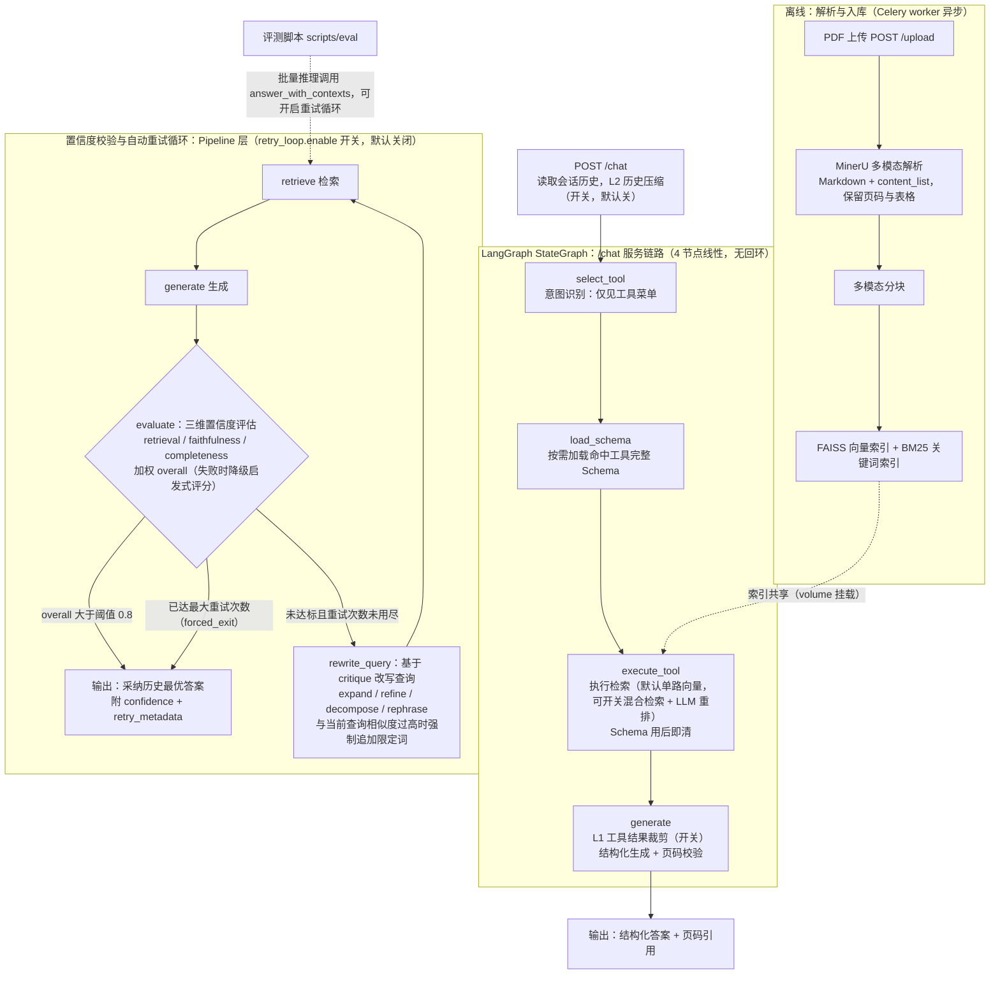

# enterprise_rag

**面向金融研报 / 长文档的深度问答 Agent**：用 LangGraph StateGraph 编排"检索 → 重排 → 生成 → 置信度校验 → 重试"全链路，重点解决长上下文下的 Token 爆炸与多轮对话退化，答案可溯源到 PDF 页码。

[](https://www.python.org/)
[](LICENSE)
[]()

---

## 动机

为什么不直接用现成 RAG 框架硬套：

1. **长文档**：一份年报动辄上百页，全量塞上下文既不现实也不经济，解析、分块、检索每一环都需要针对金融文档（表格、页码、多公司对比）定制，通用框架的默认管线控制粒度不够。
2. **多轮退化**：朴素 RAG 把全部历史和工具结果原样拼接，30+ 轮长程对话后 Token 爆炸、早期关键信息被稀释，答案质量随轮数下降。
3. **可追溯引用**：金融场景的答案必须能落到"哪份文档、哪一页"，这在工程上要求页码贯穿解析到生成的全链路，而不是事后补引用。

## 架构


```mermaid
flowchart TD
    subgraph OFF["离线：解析与入库（Celery worker 异步）"]
        A["PDF 上传 POST /upload"] --> B["MinerU 多模态解析<br/>Markdown + content_list，保留页码与表格"]
        B --> C["多模态分块"]
        C --> D["FAISS 向量索引 + BM25 关键词索引"]
    end

    CHAT["POST /chat<br/>读取会话历史，L2 历史压缩（开关，默认关）"]

    subgraph LG["LangGraph StateGraph：/chat 服务链路（4 节点线性，无回环）"]
        F["select_tool<br/>意图识别：仅见工具菜单"]
        G["load_schema<br/>按需加载命中工具完整 Schema"]
        H["execute_tool<br/>执行检索（默认单路向量，可开关混合检索 + LLM 重排）<br/>Schema 用后即清"]
        I["generate<br/>L1 工具结果裁剪（开关）<br/>结构化生成 + 页码校验"]
        F --> G --> H --> I
    end

    CHAT --> F
    I --> OUT["输出：结构化答案 + 页码引用"]

    subgraph RT["置信度校验与自动重试循环：Pipeline 层（retry_loop.enable 开关，默认关闭）"]
        R0["retrieve 检索"] --> R1["generate 生成"]
        R1 --> R2{"evaluate：三维置信度评估<br/>retrieval / faithfulness / completeness<br/>加权 overall（失败时降级启发式评分）"}
        R2 -- "overall 大于阈值 0.8" --> R3["输出：采纳历史最优答案<br/>附 confidence + retry_metadata"]
        R2 -- "未达标且重试次数未用尽" --> R4["rewrite_query：基于 critique 改写查询<br/>expand / refine / decompose / rephrase<br/>与当前查询相似度过高时强制追加限定词"]
        R4 --> R0
        R2 -- "已达最大重试次数（forced_exit）" --> R3
    end

    EV["评测脚本 scripts/eval"] -. "批量推理调用 answer_with_contexts，可开启重试循环" .-> R0
    D -. "索引共享（volume 挂载）" .-> H
```

图中 StateGraph 的 4 个节点与 [app/agent.py](app/agent.py) 一一对应，线性流转、无回环。置信度校验与重试不在 LangGraph 图内，而是 Pipeline 层的 `_answer_with_retry_loop`：每轮 retrieve → generate 后做三维置信度评估，`overall` 超过阈值 0.8 即停止；未达标则基于评估反思（critique）改写查询重试，全程保留置信度最高的一轮，超过最大重试次数（默认 2）强制退出并标记 `forced_exit`。该循环挂在库级链路 `answer_with_contexts` 上，由 `retry_loop.enable` 开关控制（默认关闭）；`/chat` 服务链路当前固定走 Agent 图，不经过重试循环。离线链路由 Celery + Redis 异步执行：上传接口立即返回 `task_id`，解析与入库进度可查询。Redis 同时承担 embedding 缓存、API 限流和 Celery broker 三个角色。

## 快速开始

前置要求：Docker 与 Docker Compose。

```bash
# 1. 克隆并配置密钥（env 为模板文件）
git clone https://github.com/uxioaln/enterprise_rag.git
cd enterprise_rag
cp env .env

# 2. 编辑 .env，填入 AGICTO_API_KEY（唯一必填项），然后一键启动
docker compose up -d --build
```

`.env` 关键内容：

```dotenv
# 必填：AGICTO 平台（OpenAI 兼容接口 https://api.agicto.cn/v1）API Key
# embedding（text-embedding-v4）/ LLM（qwen3.8-max）/ LLM 重排均走此平台
AGICTO_API_KEY=sk-your-key-here

# 可选：CORS 允许来源，逗号分隔；默认放行 localhost:3000/5173/8080
# ALLOWED_ORIGINS=https://your-frontend.example.com

# 可选：会话存储后端，sqlite（默认，持久化）/ memory（开发测试）
# STORAGE_BACKEND=sqlite
```

注意：api 容器启动时需加载 FAISS 索引，健康检查宽限期为 120s，首次启动请耐心等待 `docker compose ps` 变为 healthy。

```bash
# 3. 上传 PDF 研报（异步入库，立即返回 task_id）
curl -X POST http://localhost:8000/upload \
  -F "file=@./兴业银行2024年报.pdf" \
  -F "company_name=兴业银行"
# → {"task_id":"...","status":"pending"}

# 4. 查询入库进度
curl http://localhost:8000/tasks/<task_id>
# → {"task_id":"...","status":"success","detail":{...}}

# 5. 问答（stream=false 返回标准 JSON，默认为 SSE 流式）
curl -X POST "http://localhost:8000/chat?stream=false" \
  -H "Content-Type: application/json" \
  -d '{
    "session_id": "demo-001",
    "question": "\"兴业银行\" 2024 年的不良贷款率是多少？"
  }'
```

响应节选（完整字段见 `/docs` Swagger）：

```json
{
  "answer": "……",
  "step_by_step_analysis": "……",
  "relevant_pages": [57],
  "references": ["……可溯源至 PDF 页码……"],
  "confidence": {"overall": 0.86, "retrieval_confidence": 0.90, "faithfulness": 0.85, "completeness": 0.80},
  "elapsed_seconds": 12.4
}
```

## 核心设计

### 1. 渐进式披露（工具 Schema 按需加载）

- **问题**：多个检索工具的完整 Schema 常驻 system prompt，Token 开销随工具数线性增长。
- **做法**：LangGraph 图先做意图识别（`select_tool`），只加载命中工具的 Schema，执行完毕即从上下文清除，再进入生成节点。
- **收益**：上下文中同一时刻最多只有一套工具定义，工具数量不再侵蚀生成预算。

### 2. 两级上下文压缩

- **问题**：30+ 轮长程对话下，工具结果全文与全部历史拼接导致 Token 爆炸、信息稀释。
- **做法**：L1 按问题关键词对检索片段逐句打分，保留命中句及其上下文（上限 800 字，纯规则实现、不调 LLM），原文落盘备审计；L2 超过 5 轮后将早期对话合并为结构化摘要，仅保留最近 5 轮原文。
- **收益**：单次请求 Token 8200 → 4100（口径见下表）。

### 3. 三维置信度验证 + 自动重试

- **问题**：检索质量差时强行生成，幻觉风险高，用户也无法判断答案可信度。
- **做法**：每轮生成后由评估模型从检索质量、忠实度、完整度三个维度打分并加权为 overall，低于阈值自动改写查询重试，全程保留历史最优答案。
- **收益**：幻觉率 18% → 7%（口径见下表），且每个答案自带可解释的置信度字段。

## 评测结果

| 指标 | 基线 | 本方案 | 相对变化 |
|---|---|---|---|
| 单次请求 Token（30+ 轮长程对话） | 8200 | 4100 | -50% |
| Top-5 召回率 | 待补充 | 86.7% | — |
| 幻觉率 | 18% | 7% | -11 pp |

**RAGAS 回归（最新一轮实测，产物见 [data/eval/benchmark_report.json](data/eval/benchmark_report.json)）**：L1/L2 压缩关闭（baseline）vs 开启（optimized），10 题、每题独立会话、双臂逐题交错执行、判官 gpt-4o-mini：

| 指标 | baseline（L1/L2 关） | optimized（L1/L2 开） | 变化（optimized - baseline） |
|---|---|---|---|
| faithfulness | 0.6333 | 0.5167 | -0.1166 |
| answer_relevancy | 0.7786 | 0.751 | -0.0276 |
| context_precision | 0.7211 | 0.6609 | -0.0602 |
| context_recall | 0.75 | 0.7333 | -0.0167 |
| 平均每题 input_tokens（服务端） | 3747.9 | 3373.3 | -10.0% |
| 平均每题 final_prompt_tokens（本地估算） | 2795.1 | 2448.1 | -12.4% |

注意：单轮、10 题场景下压缩仅省约 10% token，且四项 RAGAS 指标均有下降；主表 -50% 的 Token 收益来自 30+ 轮长程对话场景，两者口径不同，不可直接比较。

**口径说明**：

- **Token**：基线为不做任何压缩的朴素 RAG，场景为 30+ 轮长程对话。待补充：Token 统计方式（服务端 `prompt_tokens` 还是本地估算）与样本数。
- **召回率**：混合检索（FAISS + BM25）+ LLM 重排后的 Top-5 召回率，对比对象为单路向量检索。待补充：单路向量检索基线的召回率数值、评测集构成与规模。
- **幻觉率**：开启置信度评估 + 自动重试前后的对比。待补充：幻觉判定方法（人工标注还是 RAGAS faithfulness 阈值反推）与样本数。
- **回归评测**：自建金融查询评测集 30 条；上表 RAGAS 回归最新一轮跑 10 题，覆盖比亚迪 / 贵州茅台 / 宁德时代 / 中芯国际年报（含 ground_truth），指标为 faithfulness / answer_relevancy / context_precision / context_recall。

## 目录结构

```text
enterprise_rag/
├── app/                          # FastAPI 服务层
│   ├── agent.py                  # LangGraph StateGraph：select→load→execute→generate
│   ├── api.py                    # /upload /chat /history /tasks /health
│   ├── tasks.py                  # Celery 异步任务：MinerU 解析与向量化入库
│   ├── services.py               # Pipeline 生命周期管理
│   ├── storage.py / db.py        # 会话存储（SQLite / 内存）
│   ├── cache.py / rate_limiter.py  # Redis embedding 缓存与 API 限流
│   ├── config.py                 # 配置热重载
│   └── main.py / schemas.py / middleware.py / celery_app.py
├── src/                          # RAG 核心链路
│   ├── pipeline.py               # 问答主链路 + 置信度重试循环
│   ├── retrieval.py              # FAISS + BM25 混合检索
│   ├── reranking.py              # LLM 重排
│   ├── context_compression.py    # L1 工具结果裁剪 + L2 历史压缩
│   ├── retrieval_evaluator.py    # 三维置信度评估
│   ├── query_rewriter.py         # 低置信度时的查询改写
│   ├── pdf_mineru.py / pdf_parsing.py / ingestion.py  # 解析与入库
│   └── prompts.py / text_splitter.py / ...
├── scripts/eval/                 # RAGAS 评测、A/B 对比、bad case 分析脚本
├── data/                         # 索引、解析产物、评测数据（运行时生成）
├── docker-compose.yml            # api + worker + redis 三服务编排
├── env                           # 环境变量模板（cp env .env）
└── Dockerfile / requirements.txt
```

## 局限与 TODO

1. **评测集规模小**：自建评测集 30 条，统计意义有限，未覆盖全部金融文档类型与问法分布。
2. **未做线上流量验证**：全部指标来自离线评测，真实并发下的表现（吞吐、延迟分布）未测量。
3. **仅支持 PDF 输入**：Word / HTML / 扫描件等其他格式未适配。
4. **单一模型供应商**：embedding / LLM / 重排均依赖 AGICTO 平台，未做多 provider 故障切换。
5. **图状态不持久化**：LangGraph 图未接 checkpointer，长程任务的断点续跑尚不支持。

## 许可与引用

本项目基于 [MIT License](LICENSE) 开源。

```bibtex
@misc{enterprise_rag_2025,
  author = {IlyaRice},
  title = {enterprise_rag: 面向金融研报的深度问答 Agent},
  year = {2025},
  url = {https://github.com/uxioaln/enterprise_rag}
}
```
